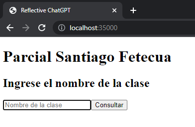
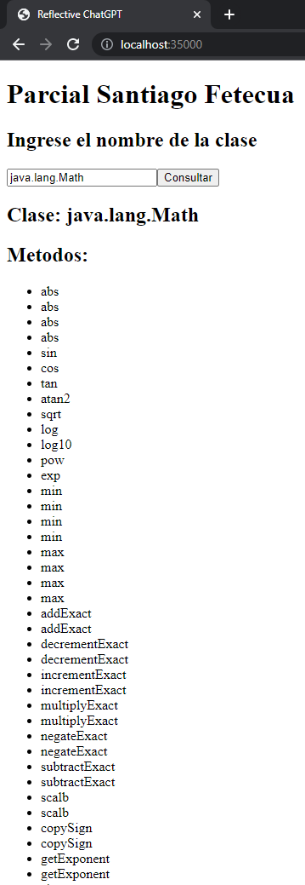
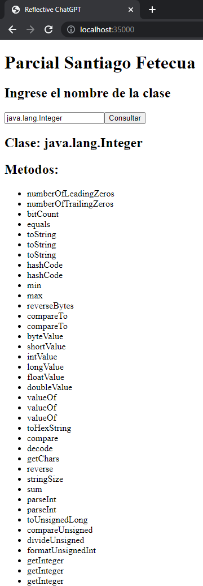

# Parcial 1 AREP - Santiago Fetecua Suarez

## Intalación

Clonar el repositorio 

```
git clone https://github.com/santiago-f20/P1AREM
```

Compilar el proyecto

```
mvn clean package
```

Ejecutar el proyecto

```
java -cp target/classes edu.eci.arep.HttpServer
```

Luego se podra ingresar a la pagina web en el puerto 35000

```http://localhost:35000```

## Uso


Se ingresa el nombre de la clase a buscar y se presiona el boton consultar



